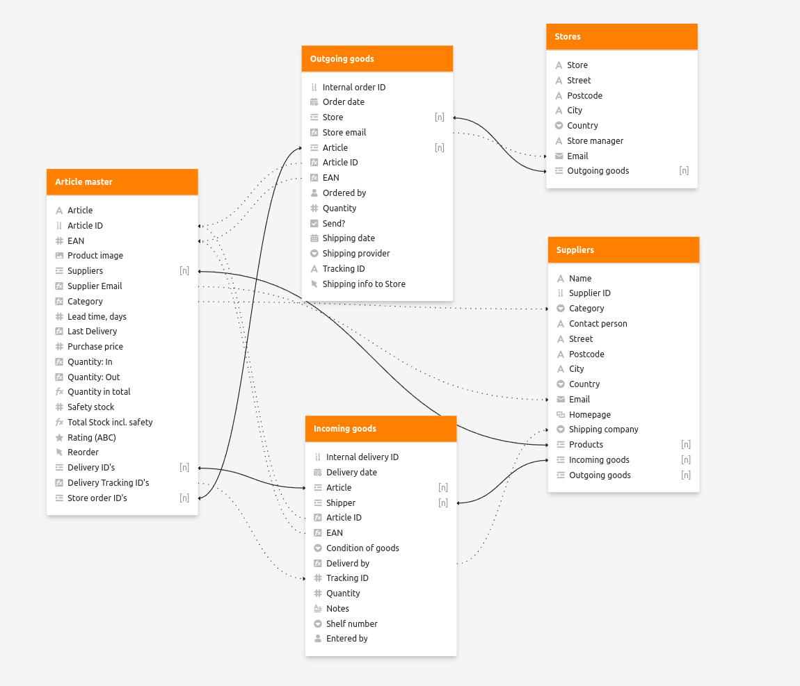

# SeaTable Plugin Table Relationship

**Table Relationship** is a SeaTable Server plugin that visualizes how tables are linked to each other through specific columns within a base.

This visualization helps users easily understand the structure and connections within their data, facilitating more efficient data management. By clearly displaying relationships, it also aids in identifying potential data inconsistencies and optimizing database design.

## What is a SeaTable Plugin?

SeaTable, the world-leading no-code app-building platform, supports plugins. Plugins provide additional visualization or interaction possibilities within a SeaTable base. Examples of SeaTable Plugins include the Gallery, the Map Plugin, or the Kanban board. You can find a list of all publicly available plugins [here](https://cloud.seatable.io/apps/custom/plugin-archive).

## How to install

In general, a Plugin needs to be installed by the system admin on the SeaTable server and can then be activated in any base by the user. More information about the installation of plugins can be found in the [SeaTable Admin Manual](https://admin.seatable.io/configuration/plugins/?h=plugins).

## How to develop and contribute to this plugin

Please refer to the [SeaTable Plugin Template](https://github.com/seatable/seatable-plugin-template-base/tree/TB-staging) documentation on GitHub. This guide explains how to set up your local testing environment, create a `setting.local.js` file to connect to a SeaTable base, and more.

## Changelog
